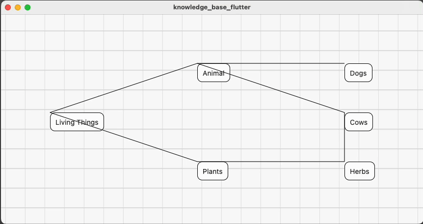

# Knowledge Base

## FIXIT

* efficient node size aquisition
    * currently keep updating
* start frame node flashing
    * also related to size aquisition
* CustomerPainter shouldReprint

## TODO

* edge type lable
* node/edge add/delete/update
  * wild edge/node statistics
  * edit history (Memo)
* node/edge query/bfs?
* node keyword attribute? duplicate category.has?
* how to handle time/history of a entity?
* better curved edge
* database & backend

## current snapshot

